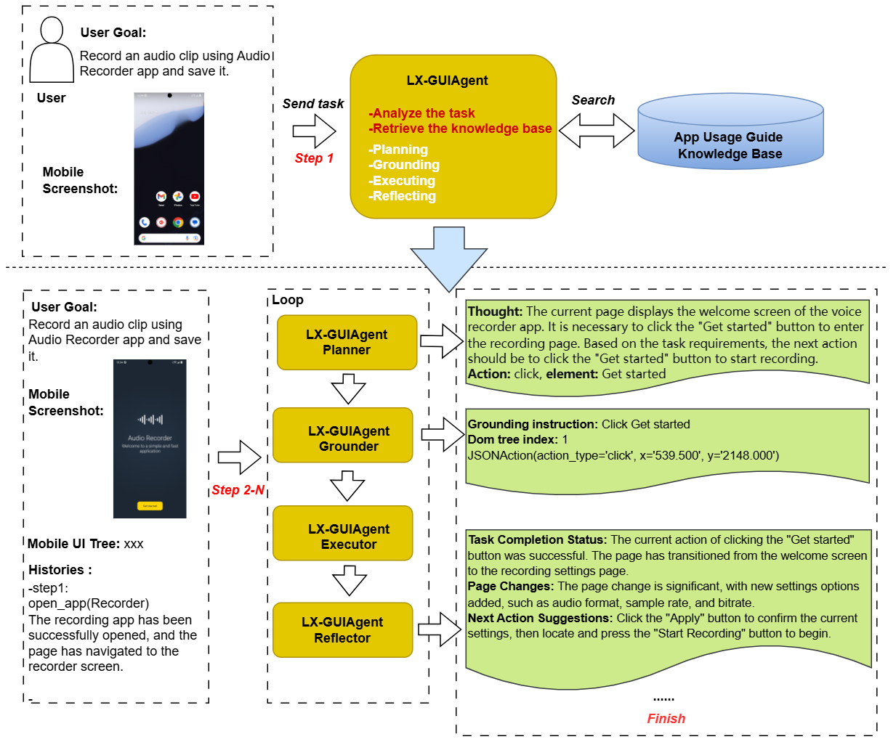

# LX-GUIAgent


[](https://github.com/LX-GUIAgent/LX-GUIAgent)

## ✨ Overview  

LX-GUIAgent is an advanced GUI Agent developed by China Mobile's LingXi, featuring innovative Planner-Grounder-Reflector frameworks:


### 🎯 Highlights
- Three-phase collaborative framework (**Planner + Grounder + Reflector**)
- Systematic task execution for complex workflows
- Modular design for flexible adaptation
- Independent optimization of components
- **75%** end-to-end success rate in [AndroidWorld](https://github.com/google-research/android_world)  


## ✨ Architecture

### Framework




## ✨ About LX-GUIAgent

**LX-GUIAgent** leverages a Planner-Grounder-Reflector architecture to address complex GUI automation scenarios. The agent features a clear separation of action planning, element grounding, and reflector modules. Operational rules, best practices, and domain-specific guidelines are systematically integrated into each module, significantly enhancing the agent's stability and accuracy.

The key innovations include:
1. **App Recognizer**: Automatically identifies target applications from user task descriptions.
2. **Operator Usage Guide Knowledge Base**: Provides tips and scenarios for using various operators, helping optimize their application in different contexts.
3. **App Usage Guide Knowledge Base**: Retrieves structured Usage_Notes (e.g. special operation paths, icon semantics, or domain-specific constraints) for the identified APP.
4. **Knowledge-Augmented Planner Prompting**: Dynamically integrates Usage_Notes into planning context for precise step-by-step reasoning.
5. **Reflector Module**: Refines and summarizes the execution results, providing clear feedback to users.
6. **Grounder Module**: Achieves precise target element localization by A11Tree structure analysis with action histories.
7. **Chinese-First Prompt Design**: All prompt content is written in Chinese to optimize performance for Chinese language models and ensure better understanding of task context.

These notes are injected into the Planner’s prompt context, enabling:

- ✅ Workflow Alignment: Ensures planning is closely matched to the specific processes of each application, minimizing unnecessary or repetitive actions.
- ✅ Robustness Enhancement: Addresses model limitations by leveraging external knowledge(eg. type with clear_text True to clear input field, prefer search other than scroll, prefer to open_app other than click app icon.).
- ✅ Rapid Adaptation: Enables fast deployment to new applications without the need for additional training.


## ✨ Technical Implementation

**Core code (lx_guiagent)**

- `lx_guiagent.py` - Core agent framework  
- `lx_guiagent_utils.py` - Core tools and utilities


**Evaluation Suite (androidworld_eval_result)**

- `androidworld_result.xlsx` - Task performance report
- `androidworld_level_result.txt` - Capability metrics

**Run Scripts (scripts)**

1. Download and install [AdroidWorld](https://github.com/google-research/android_world) environment.

2. copy agents/*.py to AndroidWorld `agents` directory

3. Edit _`get_agent` function in `run.py` of AndroidWrold to set your model and agent.

```python
elif _AGENT_NAME.value == 'LX_GUIAgent':
    base_llm = LXModelWrapper()
    rag_url = "http://ragurl"  # replace with your RAG service URL to retrieve app knowledge
    agent = LX_GUIAgent(env,planning_llm=base_llm, rag_url=rag_url,reflector_llm=base_llm, grounding_llm=base_llm)
```

4. `cd androidworld ` and Run `python run.py --agent LX_GUIAgent` to start evaluation.

## ✨ Case Studies  

### AndroidWorld Benchmark Tasks

| Difficulty | User Instruction | Demo Link                                                               |
|------------|-------------|-------------------------------------------------------------------------|
| Easy       | Record an audio clip using Audio Recorder app and save it. |  |
